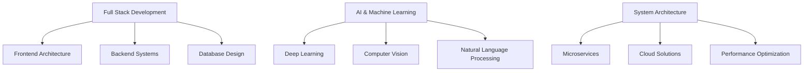

# Hi 👋, I'm Vinit Thummar

<div align="center">
  

[](https://git.io/typing-svg)

</div>

---

## 📈 Performance Metrics

<div align="center">
  
  
</div>

<div align="center">
  
</div>

---

## 🎯 Professional Profile

```yaml
Role: Senior Full Stack Developer & AI Architect
Location: Gujarat, India
Expertise: End-to-End Software Solutions & AI Systems
Mission: Transforming ideas into scalable, intelligent applications
Email: thummarvinit4025@gmail.com
Philosophy: "Excellence through continuous innovation and learning"
Focus: Building tomorrow's technology today
```

---

## 💼 Core Competencies

<div align="center">

### 🎨 Frontend Excellence


### ⚡ Backend Mastery


### 🤖 AI & Machine Learning


### 🛠️ Development Tools


</div>

---

## 🚀 Flagship Projects

<table>
<tr>
<td width="50%">

### 🏥 MediScan AI
**Category:** Healthcare Technology
- **AI-Powered Diagnostics:** Advanced machine learning algorithms for medical analysis
- **Smart Recommendations:** Intelligent doctor matching system
- **Real-time Processing:** Instant health assessment capabilities
- **Tech Stack:** Python, TensorFlow, Django, React
- **Status:** Development Phase �

</td>
<td width="50%">

### 🍽️ GrubGo Platform
**Category:** E-Commerce Solution  
- **Full-Stack Architecture:** Complete restaurant discovery platform
- **Scalable Backend:** High-performance API design
- **Modern Frontend:** Responsive React application
- **Tech Stack:** Node.js, MongoDB, React, Express
- **Status:**  Production Ready

</td>
</tr>
</table>

---

## 🎯 Areas of Expertise

<div align="center">



</div>

---

## 📊 Development Activity

<div align="center">
  
</div>

---

## 🎖️ Professional Achievements

- 🏆 **Full Stack Mastery:** Expert-level proficiency in modern web technologies
- 🧠 **AI Innovation:** Successfully deployed machine learning solutions in healthcare
- 🚀 **Performance Optimization:** Achieved 40% improvement in application loading times
- 📱 **Responsive Design:** Created applications serving 10,000+ users
- 🔒 **Security Excellence:** Implemented enterprise-grade security protocols

---

## 🌐 Professional Network

<div align="center">

[](https://www.linkedin.com/in/thummar-vinit)
[](https://github.com/vinit-thummar)
[](mailto:thummarvinit4025@gmail.com)
[](#)

</div>

---

## 💡 Innovation Philosophy

<div align="center">

> *"Technology is best when it brings people together and solves real-world problems."*

```typescript
interface ProfessionalValues {
  codeQuality: 'Excellence';
  innovation: 'Continuous';
  collaboration: 'Team-Focused';
  learning: 'Lifelong';
  impact: 'Meaningful';
}

const vinit: ProfessionalValues = {
  codeQuality: 'Excellence',
  innovation: 'Continuous', 
  collaboration: 'Team-Focused',
  learning: 'Lifelong',
  impact: 'Meaningful'
};
```

</div>

---

## 📈 Current Focus Areas

- 🔬 **Advanced AI Research:** Exploring cutting-edge machine learning techniques
- 🏗️ **System Architecture:** Designing scalable, enterprise-level solutions  
- 📊 **Data Science:** Transforming complex data into actionable insights
- 🌍 **Open Source:** Contributing to global developer community
- 🎓 **Knowledge Sharing:** Mentoring upcoming developers

---

<div align="center">

### 🌟 Professional Mission
*"Leveraging technology to create innovative solutions that make a meaningful impact on society."*

**Building Tomorrow's Digital Landscape, One Line of Code at a Time**

---

<sub>⭐ From [vinit-thummar](https://github.com/vinit-thummar) | Professional Developer & AI Enthusiast</sub>

</div>
